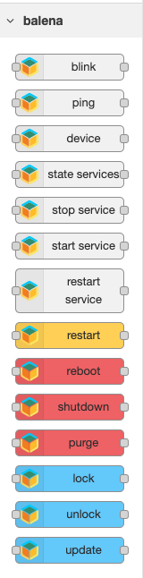

# node-red-contrib-balena
A set of nodes that allow to interact with [balena supervisor](https://balena.io/docs/reference/supervisor/supervisor-api/) from [Node-RED on balena](https://github.com/balena-io-projects/balena-node-red)

**this set of nodes works only on balena applications, check [balena-node-red](https://github.com/balena-io-projects/balena-node-red) for deploying Node-RED on balena**

# Installation

```
npm i node-red-contrib-balena -g
```

# Nodes



### Blink

A wrapper for balena-supervisor [blink endpoint](https://balena.io/docs/reference/supervisor/supervisor-api/#post-v1-blink)

Returns the HTTP Status Code

### Ping

A wrapper for balena-supervisor [ping endpoint](https://balena.io/docs/reference/supervisor/supervisor-api/#get-ping)

Returns the HTTP Status Code

### Device

A wrapper for balena-supervisor [device state endpoint](https://balena.io/docs/reference/supervisor/supervisor-api/#get-v1-device)

Returns a device state JSON object

### State Services

A wrapper for balena-supervisor [state/status](https://www.balena.io/docs/reference/supervisor/supervisor-api/#get-v2statestatus)

Returns a JSON object describing the state.

### Start Service

A wrapper for balena-supervisor [start a service](https://www.balena.io/docs/reference/supervisor/supervisor-api/#start-a-service-post-v2applicationsappidstart-service)

Returns "OK"

### Stop Service

A wrapper for balena-supervisor [stop a service](https://www.balena.io/docs/reference/supervisor/supervisor-api/#stop-a-service-post-v2applicationsappidstop-service)

Returns "OK"

### Restart Service

A wrapper for balena-supervisor [restart a service](https://www.balena.io/docs/reference/supervisor/supervisor-api/#restart-a-service-post-v2applicationsappidrestart-service)

Returns "OK"

### Restart

A wrapper for balena-supervisor [container restart endpoint](https://balena.io/docs/reference/supervisor/supervisor-api/#post-v1-restart)

Returns the HTTP Status Code

### Reboot

A wrapper for balena-supervisor [reboot endpoint](https://balena.io/docs/reference/supervisor/supervisor-api/#post-v1-reboot)

Returns the HTTP Status Code

### Shutdown

A wrapper for balena-supervisor [shutdown endpoint](https://balena.io/docs/reference/supervisor/supervisor-api/#post-v1-shutdown)

Returns the HTTP Status Code

### Purge

A wrapper for balena-supervisor [data purge endpoint](https://balena.io/docs/reference/supervisor/supervisor-api/#post-v1-purge)

Returns a JSON object

### Lock

sets the update lockfile, more info [here](https://github.com/balena-io/balena-supervisor/blob/master/docs/update-locking.md)

returns `true` when the action completes, throws an error and returns `false` when the action fails

### Unlock

removes the update lockfile, more info [here](https://github.com/balena-io/balena-supervisor/blob/master/docs/update-locking.md)

returns `true` when the action completes, throws an error and returns `false` when the action fails

### Update

A wrapper for balena-supervisor [update endpoint](https://balena.io/docs/reference/supervisor/supervisor-api/#post-v1-update) with [lock override](https://github.com/balena-io/balena-supervisor/blob/master/docs/update-locking.md#overriding-the-lock)

Returns the HTTP Status Code

# Changelog
please see [CHANGELOG.md](CHANGELOG.md)

## License

Copyright 2016 balena Ltd.

Licensed under the Apache License, Version 2.0 (the "License"); you may not use this file except in compliance with the License. You may obtain a copy of the License at

<http://www.apache.org/licenses/LICENSE-2.0>

Unless required by applicable law or agreed to in writing, software distributed under the License is distributed on an "AS IS" BASIS, WITHOUT WARRANTIES OR CONDITIONS OF ANY KIND, either express or implied. See the License for the specific language governing permissions and limitations under the License.
